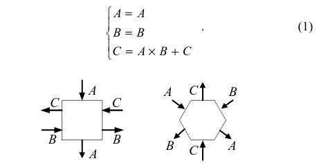
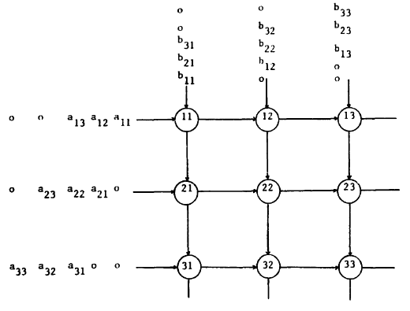

# IFSC_2021-1_PI-3_MIKAEL

Implementação de uma arquitetura sistólica para multiplicação de matrizes em FPGA

## Cronograma

| Atividade                                                         | Cronograma   |
| ----------------------------------------------------------------- | ------------ |
| [X] Desenhar o diagrama de blocos                                 | (04/06/2021) |
| [X] Pesquisar tipos de arquiteturas                               | (11/06/2021) |
| [X] Implementação da arquitetura escolhida                        | (25/06/2021) |
| [X] Testbench automátizado para validar a arquitetura             | (02/07/2021) |
| [ ] Configuração do SoC/FPGA                                      | (28/07/2021) |
| [ ] Comunicação SoC com FPGA                                      | (04/08/2021) |
| [ ] Debug e Revisão                                               | (11/08/2021) |
| [ ] Treinamento de uma NN simples para testar o funcionamento     | (18/08/2021) |
| [ ] Verificar a diferença do desempenho com e sem a implementação | (25/08/2021) |
| [ ] Documentar                                                    | (05/08/2021) |

## Diagrama de Blocos

Uma visão geral do funcionamento pode ser visto nesse diagrama.


Fonte: Autoria própria

Onde o processador faz uso do hardware físico para operações expecíficas e 
computacionalmente custosas. Nesse caso em particular uma rede neural embarcada 
utiliza o hardware especializado para fazer multiplicação de matrizes ou matriz 
e vetores.

## Arquitetura Sistólica

O princípio básico de um sistema sistólico é a de minimizar a comunicação com 
dispositivos com alta latência (memória, I/O) e fazer o máximo possível com o 
dado em mãos. Algumas características dessa arquitetura é a sua simplicidade e 
regularidade e seu altissísimo nível de paralelização.


Fonte: [Why Systolic Architectures?](https://www.cs.virginia.edu/~smk9u/CS4330S19/kung_-_1982_-_why_systolic_architectures.pdf)

O elemento mais básico de uma arquitetura sistólica é a unidade de processamento
(processing element - PE), cada célula faz apenas uma computação e passa o 
resultado adiante. Um exemplo de tal unidade pode ser visto aqui:



Fonte: [High-Performance Systolic Arrays for Band Matrix Multiplication](https://ieeexplore.ieee.org/document/1464792)

E essas unidade de processamentos podem ser organizadas em diferentes dimensões,
1D como um vetor, 2D como matriz e além. A seguinte figura mostra uma 
configuração em 3D.


Fonte: [An Efficient Parallel Algorithm for the All Pairs Shortest Path Problem using Processor Arrays with Reconfigurable Bus Systems](https://citeseerx.ist.psu.edu/viewdoc/download?doi=10.1.1.1004.9008&rep=rep1&type=pdf)

As células podem ser dispostas em diferentes configurações para alcançar 
diferentes objetivos como filtros, operações com matrizes, e convoluções.
Um exemplo que eu achei complexo é o [calculo dos mínimos quadrados em tempo real usando uma arquitetura sistólica](http://www.eecs.harvard.edu/~htk/publication/1981-matrix-triangularization-by-systolic-arrays.pdf):


Fonte: [Why Systolic Architectures?](https://www.cs.virginia.edu/~smk9u/CS4330S19/kung_-_1982_-_why_systolic_architectures.pdf)

### Multiplicação de matrizes

O objetivo desse projeto é o de fazer uso de uma arquitetura sistólica para a 
múltiplicação de matriz/matriz e matriz/vetor aliviando assim a carga para um 
processador de propósito geral. Na literatura há implementações para esse tipo 
de sistema algumas mais intuitivas que outras, fazendo uso ou não de matrizes 
esparças.

O sistema mais conhecido para mútiplicação de matriz/matriz é esse



Fonte: [A two-layered mesh array for matrix multiplication](https://www.sciencedirect.com/science/article/abs/pii/0167819188900786?via%3Dihub)

Mas como observado pelo artigo a latência para a solução disso é de 3n-2 onde n 
é a dimensão da matriz. Seguindo o artigo, pretendo implementar a seguinte 
configuração onde a latência é de 2n-1.


Fonte: [A two-layered mesh array for matrix multiplication](https://www.sciencedirect.com/science/article/abs/pii/0167819188900786?via%3Dihub)

## Testbench Automatizado

O script de automação foi feito em python, o workflow básico é o seguinte:
1. O script gera números aleatórios e grava isso em um arquivo.
2. O arquivo de testbench.vhd lê os valores gerados.
3. Os valores lidos são passados para a matriz que computa a multiplicação.
4. O resultado é armazenado em um arquivo.
5. O script em python lê os números gerados anteriormente computa a 
multiplicação e compara com o resultado do testbench.
6. Caso haja algum erro é exibido as entradas que produziram o resultado errado 
e mostra qual foi a resposta produzida pela arquitetura e qual é a resposta 
correta dada pelo modelo em python.

## SoC-FPGA

Estou usando o kit de desenvolvimento [Arrow](https://www.arrow.com/en/products/sockit/arrow-development-tools) com [Cyclone V](https://www.intel.com/content/dam/www/programmable/us/en/pdfs/literature/hb/cyclone-v/cv_5v2.pdf) que possue um ARM Cortex-A9 e um FPGA com 110K elementos lógicos programáveis além de muitos outros periféricos como VGA, USBs, Ethernet etc.

A Intel disponibilizou em seu site www.rocketboards.org um [manual de usuário desse kit](https://rocketboards.org/foswiki/Documentation/ArrowSoCKitEdition201707) para as primeiras configurações, que me foram muito úteis para entender o processo básico de boot e [configuração dos switchs](https://rocketboards.org/foswiki/Documentation/ArrowSoCKitEdition201707ConfiguringTheSockit).

### Configuração do cartão SD

Estruturação das partições no cartão SD


Referência: [rocketboards](https://rocketboards.org/foswiki/Documentation/A10GSRDCreatingAndUpdatingTheSDCardLTS)

| Localização | Nome do Arquivo        | Descrição                |
| ----------- | ---------------------- | ------------------------ |
| Partição 1  | *.dtb                  | Descrição do hardware    |
| ^           | *core.rbf              | Configuração do FPGA     |
| ^           | *periph.rbf            | Configuração dos IOs     |
| ^           | zImage                 | Imagem do Kernel         |
| ^           | extlinux/extlinux.conf | Configuração do Uboot    |
| ^           | u-boot.img             | Imagem do Uboot          |
| ^           | *.itb                  | Uboot FIT                |
| Partição 2  | qualquer               | Sistema de Arquivo Linux |
| Partição 3  | N/A                    | espaço Uboot             |

Tanto a referência da imagem quanto a descrição dessa tabela podem ser encontradas [aqui](https://rocketboards.org/foswiki/Documentation/A10GSRDCreatingAndUpdatingTheSDCardLTS)

Nem todos os arquivos da partição 1 são de fato necessários para fazer a placa bootar, por exemplo os arquivos de configuração servem para que a placa o FPGA seja programado logo que dispositivo seja energizado. Mas é possível programar a partir do sistema operacional que é o que farei para poder testar e modificar rapidamente.

### Ordem do boot

A inicialização da placa consiste em três estágios (no melhor do meu entendimento):

1. Bootloader mapeia a memória RAM, inicializa os periféricos e prepara para que o SO assuma o comando.
2. O Linux Kernel sobe faz a interface com os componentes.
3. Sistema de arquivo é estabelecido

### Scripts

Para compilar a partir do source é necessário ter a toolchain para arm que é a [Linaro toolchain](https://releases.linaro.org/components/toolchain/binaries/) faça download da mais recente que deve possuir um linux-gnueabihf

Uma explicação breve sobre a terminologia usada nesse binário.

O linux no nome diz que essa gcc foi preparada para rodar em uma plataforma linux.
eabi: Embedded Application Binary Interface
hf: Hard Floating

U-Boot
```bash
git clone http://git.rocketboards.org/u-boot-socfpga.git
cd u-boot-socfpga
git checkout -b build_boot ACDS21.1_REL_GSRD_PR
export CROSS_COMPILE=/opt/gcc-linaro-arm-linux-gnueabihf/bin/arm-linux-gnueabihf-
make mrproper
make socfpga_cyclone5_config
make
```

Linux Kernel
``` bash
git clone http://git.rocketboards.org/linux-socfpga.git
cd linux-socfpga
git checkout -b build_kernel ACDS21.1_REL_GSRD_PR
export CROSS_COMPILE=/opt/gcc-linaro-arm-linux-gnueabihf/bin/arm-linux-gnueabihf-
make ARCH=arm socfpga_defconfig
make ARCH=arm uImage LOADADDR=0x8000
```

Yocto
``` bash
mkdir yocto; cd yocto
# Clone required Yocto git trees 
git clone -b zeus https://git.yoctoproject.org/git/poky.git
git clone -b zeus https://git.openembedded.org/meta-openembedded
git clone -b master https://github.com/kraj/meta-altera.git
git clone -b master https://github.com/altera-opensource/meta-altera-refdes.git
cd meta-altera-refdes
git checkout ACDS20.1STD_REL_GSRD_PR

# Run script to initialize the build environment for bitbake
# Note: You will be redirect to "build" folder once you execute the command below
cd ..
source poky/oe-init-build-env

# Remove default settings imported from template
sed -i /MACHINE\ \?\?=\ \"qemux86-64\"/d conf/local.conf

# Use systemd
echo 'DISTRO_FEATURES_append = " systemd"' >> conf/local.conf
echo 'VIRTUAL-RUNTIME_init_manager = "systemd"' >> conf/local.conf

# Use the LTS kernel and set version
echo 'PREFERRED_PROVIDER_virtual/kernel = "linux-altera-lts"' >> conf/local.conf
echo 'PREFERRED_VERSION_linux-altera-lts = "5.4.124%"' >> conf/local.conf

# Build additional rootfs type
echo 'IMAGE_FSTYPES += "tar.gz"' >> conf/local.conf

# Settings for bblayers.conf
echo 'BBLAYERS += " ${TOPDIR}/../meta-altera "' >> conf/bblayers.conf
echo 'BBLAYERS += " ${TOPDIR}/../meta-altera-refdes "' >> conf/bblayers.conf
echo 'BBLAYERS += " ${TOPDIR}/../meta-openembedded/meta-oe "' >> conf/bblayers.conf
echo 'BBLAYERS += " ${TOPDIR}/../meta-openembedded/meta-networking "' >> conf/bblayers.conf
echo 'BBLAYERS += " ${TOPDIR}/../meta-openembedded/meta-python "' >> conf/bblayers.conf

# Set the MACHINE, only at a time to avoid build conflict
echo "MACHINE = \"cyclone5\"" >> conf/local.conf

# Ensure we build in all kernel-modules
echo "MACHINE_ESSENTIAL_EXTRA_RRECOMMENDS += \"kernel-modules\"" >> conf/local.conf

# Build rootfs image
bitbake  gsrd-console-image 
```
Fonte: [U-Boot](https://rocketboards.org/foswiki/Documentation/Gsrd131GitTrees#U_45Boot), [Kernel](https://rocketboards.org/foswiki/Documentation/Gsrd131GitTrees#Linux_Kernel), [Yocto](https://rocketboards.org/foswiki/Documentation/CycloneVSoCGSRD#Building_Root_Filesystem_Using_Yocto)